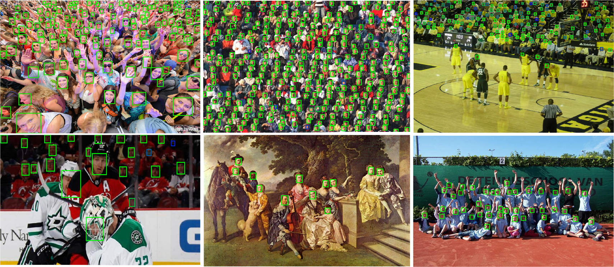

# SSH: Single Stage Headless Face Detector

## Introduction
This repository includes the code for training and evaluating the SSH face detector introduced in our [**ICCV 2017 paper**](https://arxiv.org/abs/1708.03979).


The code is adapted based on an intial fork from the py-faster-rcnn repository.

### Citing
If you find SSH useful in your research please consider citing:
```
@inproceedings{najibi2017ssh,
title={{SSH}: Single Stage Headless Face Detector},
author={Najibi, Mahyar and Samangouei, Pouya and Chellappa, Rama and Davis, Larry},
booktitle={The IEEE International Conference on Computer Vision (ICCV)},
year={2017}
}
```
### Contents
1. [Installation](#install)
2. [Ruuning the demo](#demo)
3. [Training a model](#training)
4. [Evaluting a trained model](#evaluating)

<a name="install"> </a>
### Installation
1. Clone the repository:
```
git clone --recursive https://github.com/mahyarnajibi/SSH.git
```

2. Install [cuDNN](https://developer.nvidia.com/cudnn) and [NCCL](https://github.com/NVIDIA/nccl) (used for multi-GPU training).

3. Caffe and PyCaffe: You need to compile the ```caffe-ssh``` repository which is a  Caffe fork compatible with SSH. Caffe should be built with *cuDNN*, *NCCL*, and *python layer support* (set by default in ```Makefile.config.example```). You also need to ```make pycaffe```.

4. Install python requirements:
```
pip install -r requirements.txt
```

5. Make ```setup.py``` in the ```lib``` directory:
```
cd lib
make
```

<a name="demo"></a>
### Running the demo
To run the demo, first, you need to download the provided pre-trained SSH model. Running the following script downloads the SSH model into its default directory path:
```
bash scripts/download_ssh_model.sh
```
By default, the model is saved into a folder named ```data/SSH_models``` (you can create a symbolic link for ```data``` if you plan to use an external path).

After downloading the SSH model, you can run the demo with the default configuration as follows:
```
python demo.py
```
If everything goes well, the following detections should be saved as ```data/demo/demo_detections_SSH.png```.
<p align="center">

</p>

For a list of possible options run: ```python demo.py --help```

<a name="training"></a>
### Training a model
For training on the *WIDER* dataset, you need to download the [WIDER face training images](https://drive.google.com/file/d/0B6eKvaijfFUDQUUwd21EckhUbWs/view?usp=sharing) and the [face annotations](http://mmlab.ie.cuhk.edu.hk/projects/WIDERFace/support/bbx_annotation/wider_face_split.zip) from the [dataset website](http://mmlab.ie.cuhk.edu.hk/projects/WIDERFace/). These files should be copied into ```data/datasets/wider/``` (you can create symlinks if you prefer to store the actual data somewhere else).

You also need to download the pre-trained *VGG-16*  ImageNet model. The following script downloads the model into the default directory:
```
bash scripts/download_imgnet_model.sh
```

Before starting to train  you should have a directory structure as follows:
 ```
data
   |--datasets
         |--wider
             |--WIDER_train/
             |--wider_face_split/
   |--imagenet_models
         |--VGG16.caffemodel
```
For training with the default parameters, you can call the ```main_train``` module with a list of GPU ids. As an example:
```
python main_train.py --gpus 0,1,2,3
```
For a list of all possible options run ```python main_train.py --help```.

Please note that the default training parameters (*e.g.* number of iterations, stepsize, and learning rate) are set for training
on 4 GPUs as described in the paper. 

All SSH settings and configurations can be changed by passing an external configuration file to the module (```--cfg [path-to-config-file]```. See ```SSH/configs``` for example config files).

By default, the models are saved into the ```output/[EXP_DIR]/[db_name]/``` folder (```EXP_DIR``` is set to ```ssh``` by default and can be changed through the configuration files,
and ```db_name``` would be ```wider_train``` in this case).

<a name="evaluating"></a>
### Evaluating a trained model
The evaluation on the *WIDER* dataset is based on the official *WIDER* evaluation tool which requires *MATLAB*.
you need to download the [validation images](https://drive.google.com/file/d/0B6eKvaijfFUDd3dIRmpvSk8tLUk/view?usp=sharing) and 
the [annotations](http://mmlab.ie.cuhk.edu.hk/projects/WIDERFace/support/bbx_annotation/wider_face_split.zip) (if not downloaded for the training) from the 
*WIDER* [dataset website](http://mmlab.ie.cuhk.edu.hk/projects/WIDERFace/). These files should be copied into the ```data/datasets/wider``` directory as follows:
 ```
data
   |--datasets
         |--wider
             |--WIDER_val/
             |--wider_face_split/
```

The evaluation can be performed with the default configuration by calling the ```main_test``` module:
```
python main_test.py --model [path-to-the-trained-model]
```
For a list of possible options run ```python main_test.py --help```. 

All the *SSH* settings and configurations can be changed by passing an external configuration file to the module (```--cfg [path-to-config-file]```. See ```SSH/configs``` for example config files).

The evaluation outputs are saved into ```output/[EXP_DIR]/[db_name]/[net_name]``` (```EXP_DIR``` is set to ```ssh``` by default and can be changed by passing a config file, ```net_name``` can be directly passed to the module and is set to ```SSH``` by default, and ```db_name```  would be ```wider_val``` in this case). This includes the detections saved as text files in a folder named ```detections```,detections saved as a ```pickle``` file, and the ```WIDER``` evaluation plots saved in a folder named ```wider_plots```. 

Please note that the detections will be cached by default and will not be re-computed again (the caching can be disabled by passing the ```--no_cache``` argument.)

